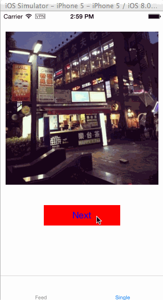

DXRoundProgressImageView
========================

Show download progress imageview like instagram's loading imageView

###How to use

Just instance a RoundProgressImageView example as roundImageView and then

	    [roundImageView prSetImageWithURL:imageURL placeholderImage:nil];

###Goodness

1. Support cancel the image load.
2. If the image load failed, support tapping to reload the image.

###Demo

1. Feed shows how to show images like instagram
2. Some tricky to load batch images and catch background

###Credits

This is build base on SDWebImage.